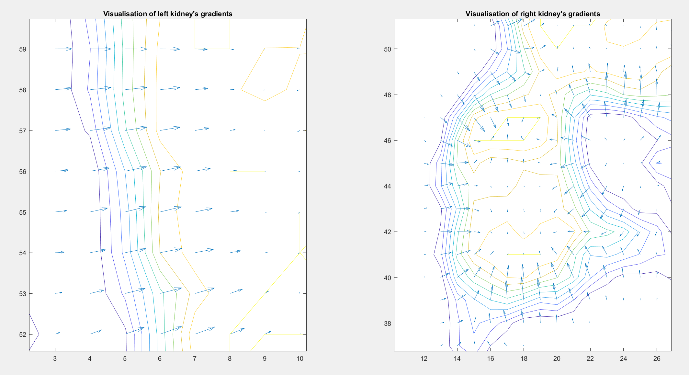

## CT Image Edge Detection with Gradient Analysis
The project was created for the Numerical Methods course at my University.  
**Goal:** Create a function in MATLAB that analyzes the gradient of a computed tomography (CT) image to identify the boundaries of organs, such as the kidneys.  
### Method Description
The method involves using the gradient of the image intensity function, which can assist in delineating contours and boundaries of anatomical structures based on changes in intensity.  
At the beginning, the region of interest is manually selected to find only the boundaries of the kidneys. The the images is cropped to the given bounding boxes.  
The next step is the preprocessing of the images using low-pass filters. The filters are chosen independently for each region of interest. Their sample descriptions are as follows:  
* Left Kidney: Averaging low-pass filter with dimensions 5x5.
* Right Kidney: Median low-pass filter with dimensions 3x3.

The next step was to compute the gradient using the Sobel filter. Both regions of interest used the same filters. The resultant gradient magnitude is also calculated based on the horizontal and vertical gradients, which is then scaled to the range <0,1>.    
  
The final step before presenting the results is the post-processing phase. First, based on selected thresholds, a value is determined above which a pixel is considered to belong to an edge. These thresholds were set to relatively low values due to the subsequent application of median filters to remove isolated points that are not part of the edges. A 5x5 filter was applied to the left kidney, while a 3x3 filter was applied to the right kidney.

### Technologies
* Matlab
### Features
* Pre-process bounding-boxes with averaging/median low-pass filter
* Calculate the Sobel Gradient for edge detection
* Calculate Gradient Magnitude
* Post-process bounding-boxes with median low-pass filter
* Present the results
### Setup and usage
After downloading the repository one should simply run it in Matlab. One can play with the selection of the filters.
### Results of the script
Below one can see the results of the script. The first figure shows the original bounding-boxes, horizontal, vertical and comined edges for both kidneys:  
  
The second figure shows the visualisation of the gradient vectors  
  
The following figure shows the same figure but zoomed in  

The last figure shows the original image with highlighted edges  
